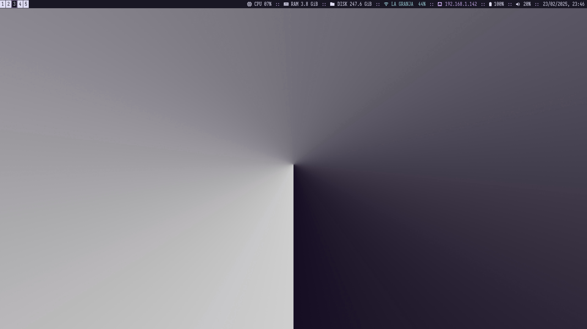
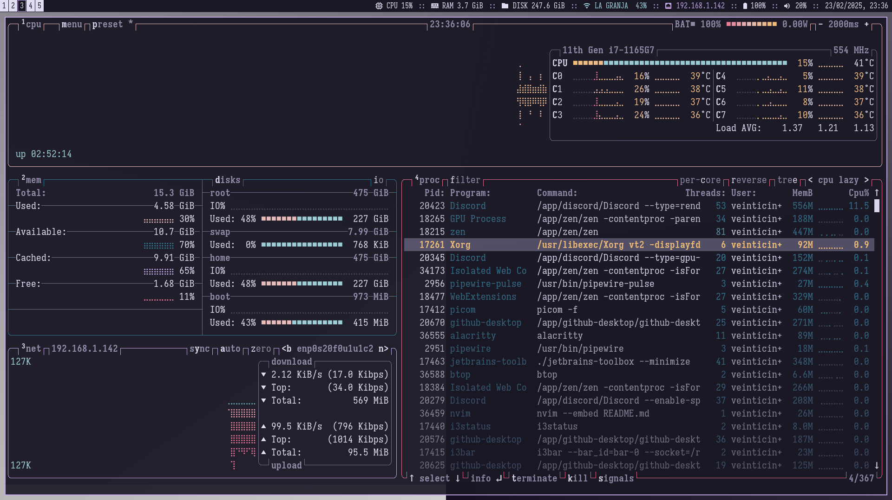
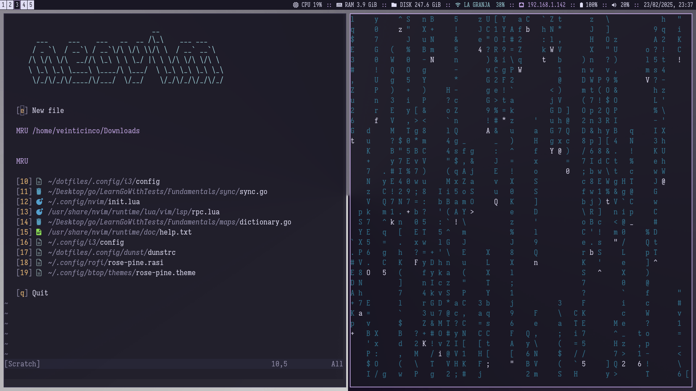

# DCCXXV's dotfiles

This repository contains my sistem's configuration files (dotfiles).

One click install using GNU stow. More information in [Installation](#installation)

Currently using rosé pine theme.

## Screenshots







## Requirements

Ensure you have the following installed on your system

### Git

Ubuntu/Mint/Debian
```
sudo apt install git
```

Fedora/CentOS/RHEL
```
sudo dnf install git
```

Arch/Manjaro
```
sudo pacman -S git
```

### Stow

Ubuntu/Mint/Debian
```
sudo apt install stow
```

Fedora/CentOS/RHEL
```
sudo dnf install stow
```

Arch/Manjaro
```
sudo pacman -S stow
```

## Installation

First, check out the dotfiles repo in your $HOME directory using git

```
cd $HOME
git clone git@github.com/DCCXXV/dotfiles.git
cd dotfiles
```

then use GNU stow to create symlinks

>![IMPORTANT]
>Remove any file where stow will create the symlinks before running it, otherwise it will do nothing.

```
stow .
```
